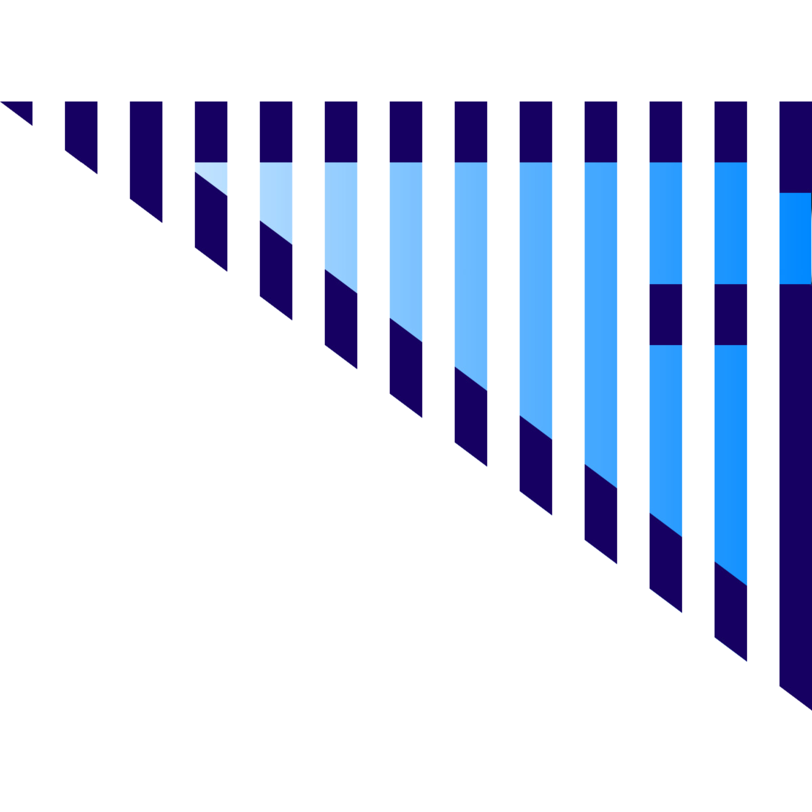

# SEEDs Web V2.0.0 © 2024

Powered by **Geospectrum Analytics Services, Inc.**

## About the Project

**SEEDs Web** is a project developed and maintained by **Geospectrum Analytics Services, Inc.**

### Framework

SEEDs Web is built using the Javascript programming language, through the full MERN stack of **MongoDB**, **Express.js**, **React.js**, and **Node.js**, with **Vite.js** for the front-end development. MongoDB is a document-oriented database used to store the web application's data. Node.js and its web framework, Express.js, handles server-side requests and processes while React.js handles client-side functionalities and the user interface. The full-stack three-tier JavaScript-based architecture of the web application allows for efficiency during project development and maintenance and scalability in data handling and project management. The project utilizes multiple APIs and various open-source JavaScript-based libraries, including Leaflet for the visualization of spatial data and Material UI for the general front-end layout and properties of SEEDs Web.

### Initialization

On the powershell, navigate to the path where the cloned repository is stored.

At the root, install the required dependencies using the command `npm install`.

Create a production build using the command `npm run build`.

To view the preview of the build, use the command `npm run preview`.

The default start of the server is set to be at http\://localhost:5173.

## Authors

* **Pamela Anne Todoc** (**@[pamucchi](https://github.com/pamucchi)**)
* **Andrew Timothy Cervantes** (**@[pagpapahinuhod](https://github.com/pagpapahinuhod)**)

See also the list of [contributors](https://github.com/geospectrum-ph/seeds/contributors) who participated in this project.

## License

SEEDs Web is owned and maintained by Geospectrum Analytics Services, Inc. All rights reserved.

For more details about the development of the website and usage of the program and any section of the code, and for more information about Geospectrum Analytics Services, Inc., please visit **https://www.geospectrum.com.ph** or reach out through **it.support@geospectrum.com.ph**.